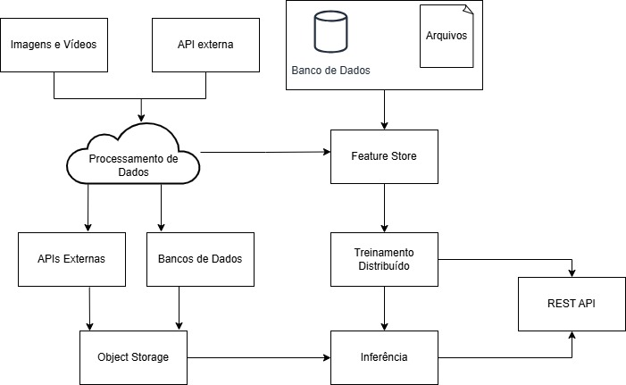

# Parte 1: Classificador Binário de Imagens - Cavalos x Humanos

Este projeto realiza a classificação binária de imagens para identificar se a imagem enviada representa um **cavalo** (`horse`) ou um **humano** (`human`). Ele inclui treinamento, avaliação e inferência via API REST.

---

## Justificativas Técnicas

### Bibliotecas e Frameworks

- **PyTorch Lightning**: abstrai boilerplate de treino e validação com foco em reprodutibilidade e organização.
- **Torchvision**: carregamento e transformações em imagens.
- **scikit-learn**: métricas de avaliação robustas (f1-score, acurárica e matriz de confusão).
- **FastAPI**: para servir inferência via REST.
- **Poetry**: gerenciamento moderno de dependências e ambientes virtuais.

### Arquitetura

- Modelo base: `ResNet18` pré-treinada (transfer learning).
  - Boa relação entre performance e tempo de treino.
  - Evita necessidade de milhares de imagens com poucos dados.
- Camada de saída com 1 unidade e ativação `sigmoid`, pois trata-se de um problema de classificação **binária**.

### Função Objetivo

- **Binary Cross-Entropy (BCE)**, a função padrão para classificação binária.

### Estratégia de Validação

- Separação explícita de diretórios `train/` e `validation/`.
- Uso de métricas `val_loss`, `val_acc` e `val_f1`.
- `EarlyStopping` com `ModelCheckpoint`, isto é, o melhor modelo é salvo nas iterações de treinamento para evitar overfitting e o processo pára antes da época final, caso o desempenho não melhore nas próximas 5 épocas.

---

## Setup do Ambiente

Requisitos: Python 3.10+

```bash
# Instalar Poetry
curl -sSL https://install.python-poetry.org | python3 -

# Clonar o projeto. 
# Obs: Os dados de treinamento e validação já estão disponíveis no próprio repositório por conveniência. Não foi possível enviar o modelo para o repositório devido seu tamanho ser superior a 100MB. Será necessário treinar localmente para validação.
git clone https://github.com/henriqueh146/w2_image_classifier.git
cd w2_image_classifier

# Instalar dependências
poetry install

# Ativar o ambiente
poetry shell

# Ativar API
uvicorn src.api:app --reload

```

### Treinamento
```bash
python src/train.py
```

### Avaliação
```bash
python src/eval.py
```

### Inferência

1. Com a API ativada (conforme instrução acima), acessar a URL http://localhost:8000/docs no navegador.
2. Click em POST
3. Click em "Try it Out!"
4. Click em "Escolher Arquivo"
5. Selecionar imagem do dataset de validação
6. Click no botão "Execute"

Seguindo este passo a passo, a API retornará uma resposta no seguinte formato:

```bash
{
  "prediction": "Is a human"
}
```

Ou você pode acessar a API via curl, onde "path/para/imagem.png" deve ser substituído pelo path da imagem na sua máquina:

```bash
curl -X POST "http://localhost:8000/predict" \
  -H  "accept: application/json" \
  -H  "Content-Type: multipart/form-data" \
  -F "file=@path/para/imagem.png"

```

## Desempenho

Com base no script de avaliação, obtivemos o seguinte:
```bash
Confusion Matrix:
[[120   8]
 [  5 123]]

Classification Report:
              precision    recall  f1-score   support
      horses       0.96      0.94      0.95       128
      humans       0.94      0.96      0.95       128
    accuracy                           0.95       256
```
Ou seja, o modelo atende ao problema proposto. A acurácia é alta (95%) e o F1 score está equilibrado entre classes. Temos baixa taxa de falsos positivos/negativos e o threshold customizado otimiza ainda mais a F1.

## Próximos Passos
Fazer análise de threshold para uso na API

Empacotar em container Docker

Testes automatizados de inferência

Implementar data augmentation no treino

Deploy monitorado com Prometheus

---
---

# Parte 2: Arquitetura de Operacionalização para Classificação de Imagens e Vídeos em Alta Escala

## Visão Geral

O sistema proposto tem como objetivo classificar imagens e vídeos de múltiplas fontes e classes em escala empresarial, suportando treinamento contínuo, atualização do modelo e inferência em tempo real.

A arquitetura é dividida em três grandes blocos:
1. Coleta e Ingestão de Dados
2. Processamento e Treinamento Distribuído
3. Inferência e Serviçamento via API



## Componentes do Sistema

### 1. Fontes de Dados
- Imagens/Vídeos: provenientes de câmeras ou uploads de usuários.
- APIs Externas: fontes públicas ou privadas (ex: Open Images, sistemas de segurança, etc.).
- Bases de Dados: armazenamentos relacionais ou NoSQL contendo metadados ou labels.
- Arquivos: datasets CSV, Parquet ou JSON com rótulos, logs ou metadados.

### 2. Data Processing
- Pipeline para coleta, limpeza, transformação e padronização os dados.
- Pode usar Spark para escala.
- Imagens são armazenadas em Object Storage (como Amazon S3, GCS, Azure Blob) com versionamento.

### 3. Object Storage
Armazena os artefatos brutos e pré-processados (imagens, vídeos, datasets).

### 4. Feature Store
- Repositório central de features extraídas ou criadas.
- Garante consistência entre treino e inferência.
- Exemplo: Databricks Feature Store.

### 5. Treinamento Distribuído
- Utiliza recursos escaláveis (GPU clusters) via frameworks como:
  - PyTorch Lightning, HuggingFace Accelerate
  - Infraestrutura: Kubernetes + Ray, SageMaker, Vertex AI Training, Databricks
- Integração com MLFlow para rastreabilidade.

### 6. Inference Engine
Pipeline de inferência desacoplado do pipeline de treino. Pode ser batch ou online.

### 7. REST API
- Serviço de inferência exposto via FastAPI.
- Recebe imagem como input e retorna a classe prevista.
- Pode ser hospedado em um cluster Kubernetes com autoescalonamento, cache e monitoramento.

## Justificativas Técnicas

### Decisão Justificativa
| Decisão                      | Justificativa                                                               |
|-----------------------------|------------------------------------------------------------------------------|
| ResNet + Transfer Learning  | Evita treinar do zero com poucos dados, reduz custo computacional.           |
| PyTorch Lightning           | Escalável, modular, integra com MLFlow e facilita produção.                  |
| Object Storage              | Suporte nativo a arquivos grandes, barato, versionável.                      |
| Feature Store               | Permite consistência entre produção e treinamento.                           |
| API REST                    | Ponto de entrada simples e universal para sistemas consumidores.             |
| Treinamento distribuído     | Necessário para lidar com dados de alta resolução e múltiplas classes.       |
| Pipeline unificado de dados | Evita silos de dados e garante qualidade do dado de entrada.                 |

### Integração e Entrega Contínuas
Este sistema suporta treinamento e revalidação contínua, com CI/CD de modelos e dados, seguindo os princípios de MLOps:

1. Dados novos ingeridos regularmente.
2. Métricas monitoradas em produção.
3. Gatilhos de retreinamento automático com novos dados ou degradação de performance.
